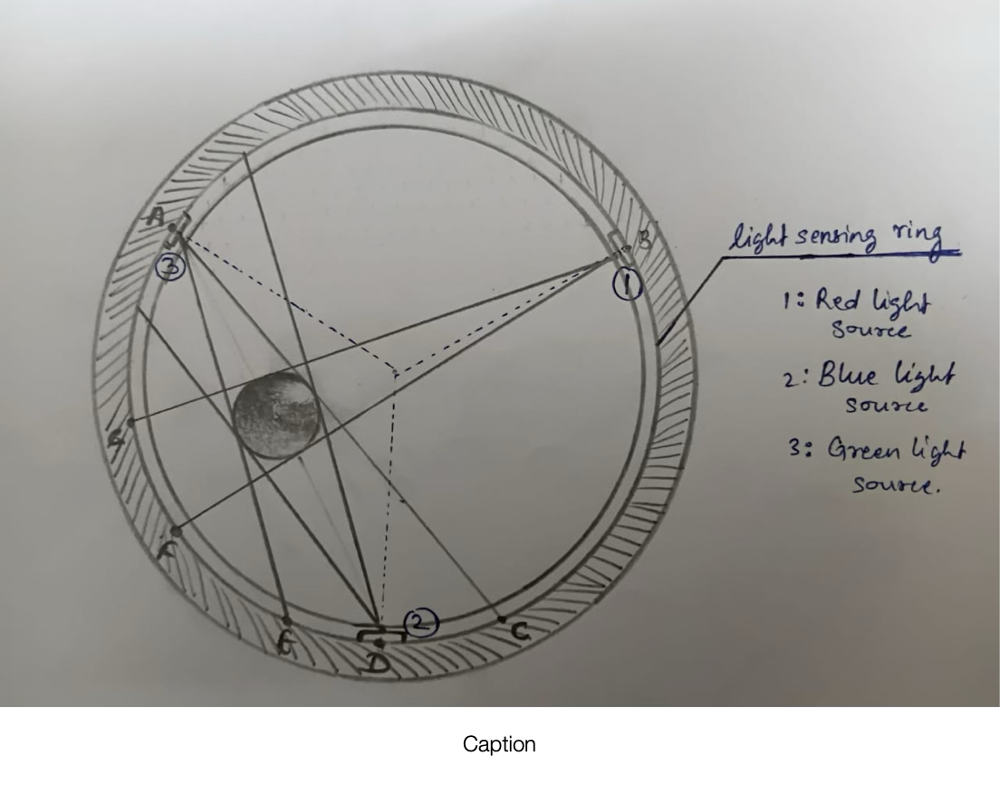
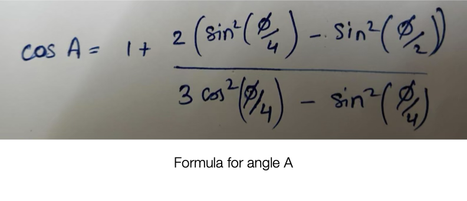
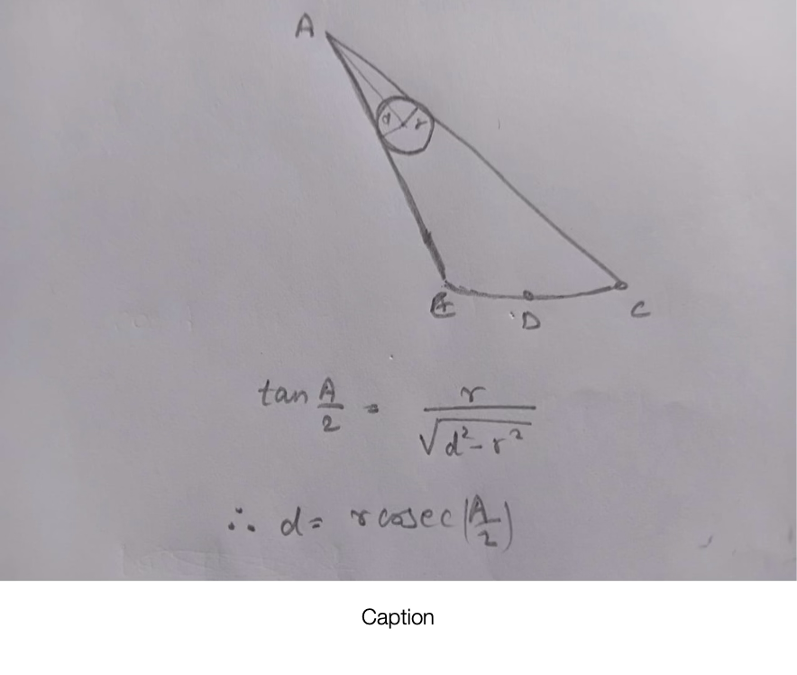
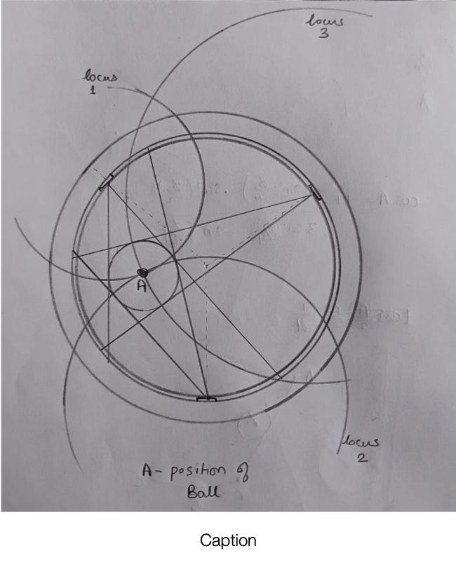
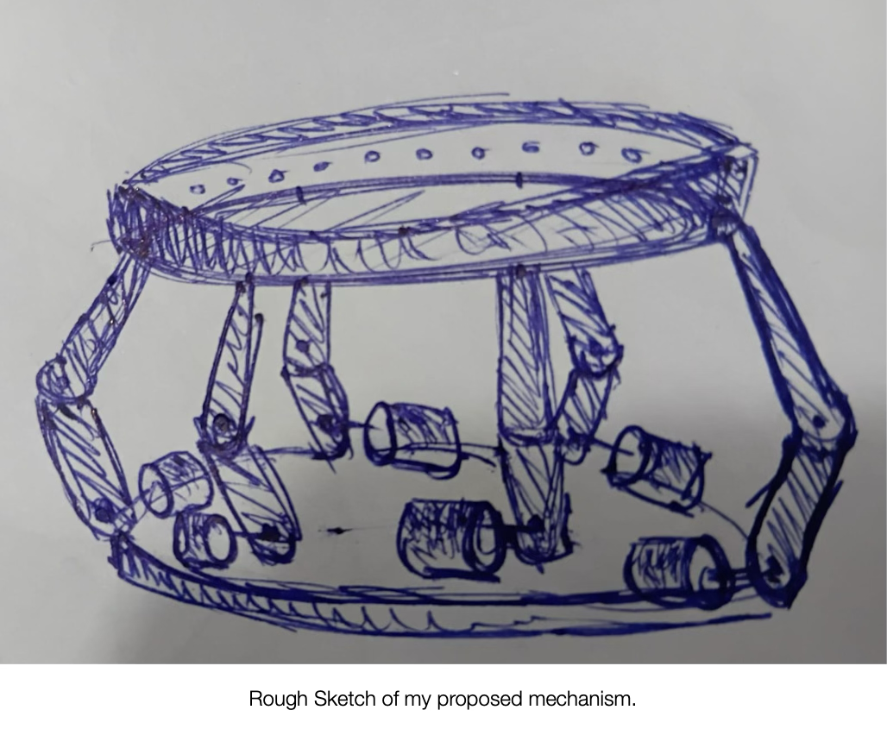

# Ball Balancing Robot 

## My Proposal:-

We can add ‘**three** **light sources**’ on the rim of a ‘**ring sensor strip**’ so that we can get precise position of the ball on the basis of ‘**Law of Reflection**’. 

## Explanation of my Proposal

So , ‘1’, ’2’, ’3’ are three light sources at an angle of 120° at the rim. These three light sources are ‘**Red**’, ’**Blue**’, ’**Green**’. And we have a ring light sensor which detects light and its wavelength. 

### Analysis:

#### 1. Red Light:

**a.** When the sensor will emit Red Light. The Arc **ABC** and **AFE** will detect Red Light. But no Red Light will be detected in the region of arc **EDC**. 

Hence we can create imaginary lines **AC** and **AE** such that we get a geometric figure **AEDC**. 

Now using trigonometry and geometry, we can find the position of the ball. 

**b.** When the ball is moving the arc angle **EDC** will change, on that basis we can calculate the velocity of ball. 

#### 2. Blue and Green Light:

**a.** Similar to the Red Light. We can calculate the velocity of ball and position of ball and use it for further processes. 

##  Some summarized calculations of my proposal:

Angle CAE = **A** | Angle FBG= **B** | Similarly Angle **D**

radius of ball = ‘**r**’ | Radius of tray \(tray in which we will balance the ball\) = ‘**R**'

Centre of tray=‘**O**’ and 

distance of ball from source A is ‘**d**’

—————————————————————

#### All the knowns:
> Length of Arc , Radius of tray and ball. 

Now let’s do the calculations for Red Light\(Similar calculations will be there for Blue and Green lights\):

Let Length of arc EDC be L; 

Let angle of arc EOC be ‘**ø**’; 

Then ø=L/R:
Then

Now , one variable A has been found by us. 

Let’s find distance ‘**d**’:

As we have the value of cosA we can 

Simply find d :

Now, we can use these formula for Blue and Green lights and get the distances from them respectively.

Now as we have the distances from all three lights, we can precisely find the location of the ball by using locus method.

Locus Method Application: All the points lying at distance ‘d’ from red light form a circle . Similar circle forms around blue and green light source. In ideal conditions the intersection of these three circles should be a point which is the position of the ball.

We can simply find the point of intersection with simply coordinate geometry.And also it is somehow possible and feasible to program this.

**So, this is how we can actually visualize the position of the ball without using camera and computer vision.**

## **Pros and Cons**

### **Pros:**

1. We get a precise position and velocity of ball using this process. 

2. No need of camera, only sensors can analogically find the dynamics of the ball. 

3. For the dynamics of the ball , the programming is just maths. 

4. We can easily co-relate the position of ball on the tray with the balancing bars which will balance the ball in a single loop. 

5. Light sensors are comparatively very cheap priced. 

### **Cons:**

1. Ideally the intersection of the loci will be single point. But we would use a countable number of sensors on the ring which may create discrete results rather than smooth so this may lead to 2D intersection of loci. 

**But this issue can be solved by using some simple techniques in programming.** 

**If not by this intersection region we can get the approximate position of the ball which provides** **enough information to balance the ball.** 

## **My proposed Mechanism**
 
 We can try making the bot use 3-DOF than 2-DOF for getting better command on the motion of the ball. 

3-DOF will control the ball efficiently because the tracking of ball motion will be more accurate in this method. 

### **Mechanical design:**

1. There will be 6 rotary motors and 6 actuators. 

2. 6 motors will be aligned at 60° at the Bottom base 

3. 6 actuators aligned at 60° at the Bottom base 

4. The tray will be 13-14cm above the bottom base in normal balanced mode. 

## **Pros and Cons**

### **Pros:**

3-DOF provide better alignment to the whole system to stand firm. And 6 actuators will make it easier to balance the ball on the tray.Light sensors are cheaper in cost. 

### **Cons:**

6 motors and 6 actuators will increase the cost & weight of the robot. 

Rough Sketch of my proposed mechanism. 

